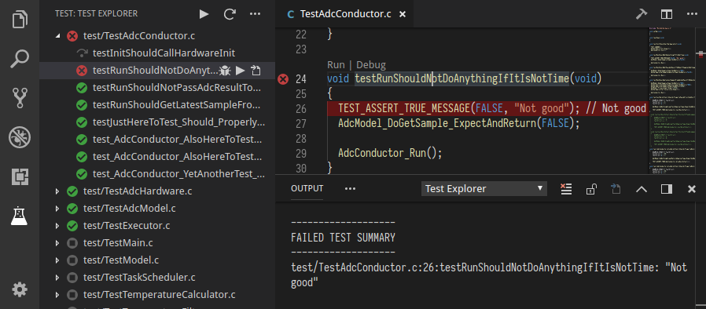

# Ceedling Test Explorer for Visual Studio Code

Run your [Ceedling](https://github.com/ThrowTheSwitch/Ceedling) tests using the 
[Test Explorer UI](https://marketplace.visualstudio.com/items?itemName=hbenl.vscode-test-explorer).



## Features

* Shows a Test Explorer in the Test view in VS Code's sidebar with all detected tests and suites and their state
* Adds CodeLenses to your test files for starting and debugging tests
* Adds Gutter decorations to your test files showing the tests' state
* Adds line decorations to the source line where a test failed
* Shows a failed test's log when the test is selected in the explorer
* Lets you choose test suites that should be run automatically after each file change

## Getting started

* Install the extension and restart VS Code
* Open the workspace or folder containing your Ceedling project
* Configure your `project.yml` path in the VS Code's settings if required [see below](#options)
* Configure the shell path where ceedling is installed in the VS Code's settings if required (It might be required on Windows) [see below](#options)
* Enable the `xml_tests_report` Ceedling plugin in your `project.yml` [see the ceedling doc](https://github.com/ThrowTheSwitch/Ceedling/blob/master/docs/CeedlingPacket.md#tool-element-runtime-substitution-notational-substitution)
* Open the Test view
* Run your tests using the  icons in the Test Explorer or the CodeLenses in your test file

## Configuration

### Options

Property                                | Description
----------------------------------------|---------------------------------------------------------------
`ceedlingExplorer.projectPath`          | The path to the ceedling project (where the `project.yml` is) to use (relative to the workspace folder). By default (or if this option is set to `null`) it use the same path as the workspace folder.
`ceedlingExplorer.shellPath`            | The path to the shell where ceedling is installed. By default (or if this option is set to `null`) it use the OS default shell.
`ceedlingExplorer.debugConfiguration`   | The Debug configuration to run during debugging. See Debugging for more info.  

## Commands

The following commands are available in VS Code's command palette, use the ID to add them to your keyboard shortcuts:

ID                                 | Command
-----------------------------------|--------------------------------------------
`test-explorer.reload`             | Reload tests
`test-explorer.run-all`            | Run all tests
`test-explorer.run-file`           | Run tests in current file
`test-explorer.run-test-at-cursor` | Run the test at the current cursor position
`test-explorer.cancel`             | Cancel running tests

## Debugging

To set up debugging, create a new Debug Configuration. `${command:ceedlingExplorer.debugTestExecutable}` 
can be used access the .out test executable filename (without directory) being ran. Depending on your Ceedling configuration
these can be found in `projectPath/build/test/out/`. Then, edit the `ceedlingExplorer.debugConfiguration` settings with the name of the Debug Configuration to run during debug.

Note: Individual test debugging is not supported. Instead the entire test file will be ran, so skip or remove breakpoints accordingly.

Example configuration with Native Debug (`webfreak.debug`):
```json
{
    "name": "Ceedling Test Explorer Debug",
    "type": "cppdbg",
    "request": "launch",
    "program": "${workspaceFolder}/build/test/out/${command:ceedlingExplorer.debugTestExecutable}",
    "args": [],
    "stopAtEntry": false,
    "cwd": "${workspaceFolder}",
    "environment": [],
    "externalConsole": false,
    "MIMode": "gdb",
    "miDebuggerPath": "C:/MinGW/bin/gdb.exe",
    "setupCommands": [
        {
            "description": "Enable pretty-printing for gdb",
            "text": "-enable-pretty-printing",
            "ignoreFailures": true
        }
    ]
}
```

## Known issues

* Cannot use both the junit ceedling plugin and the xml plugin required by this extension because they are using the same ouput filename by default. If the version of the ceedling you are using is greather than 0.28.3, you should be able to configure the output filename. [#20](https://github.com/numaru/vscode-ceedling-test-adapter/issues/20)

## Troubleshooting

If you think you've found a bug, please [file a bug report](https://github.com/numaru/vscode-ceedling-test-adapter/issues).
